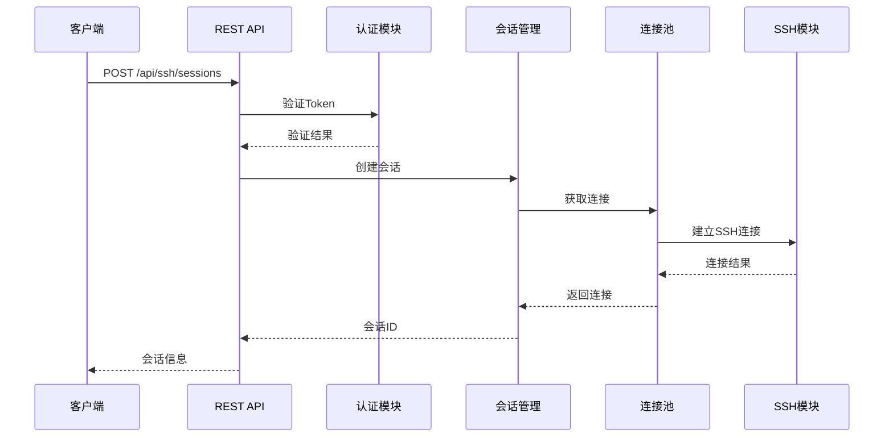
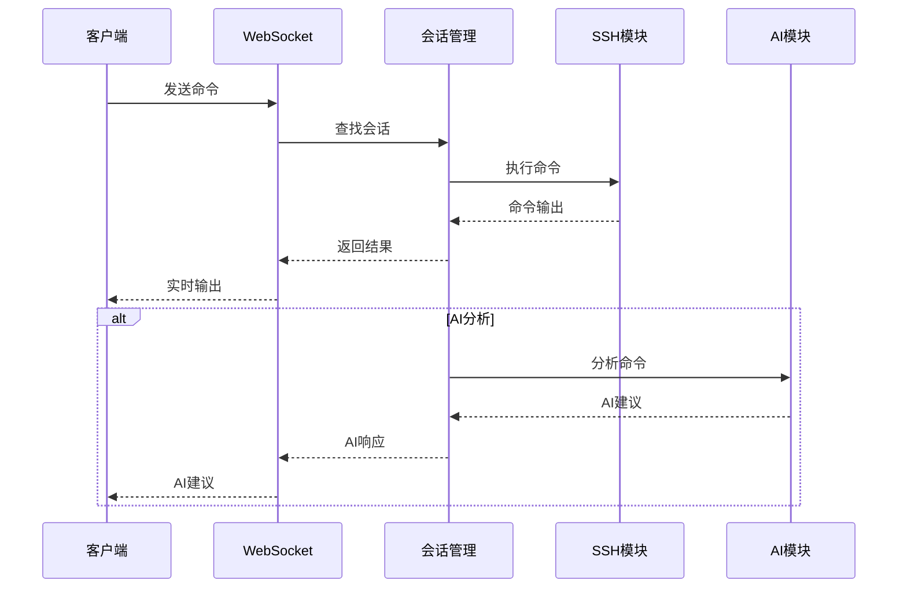
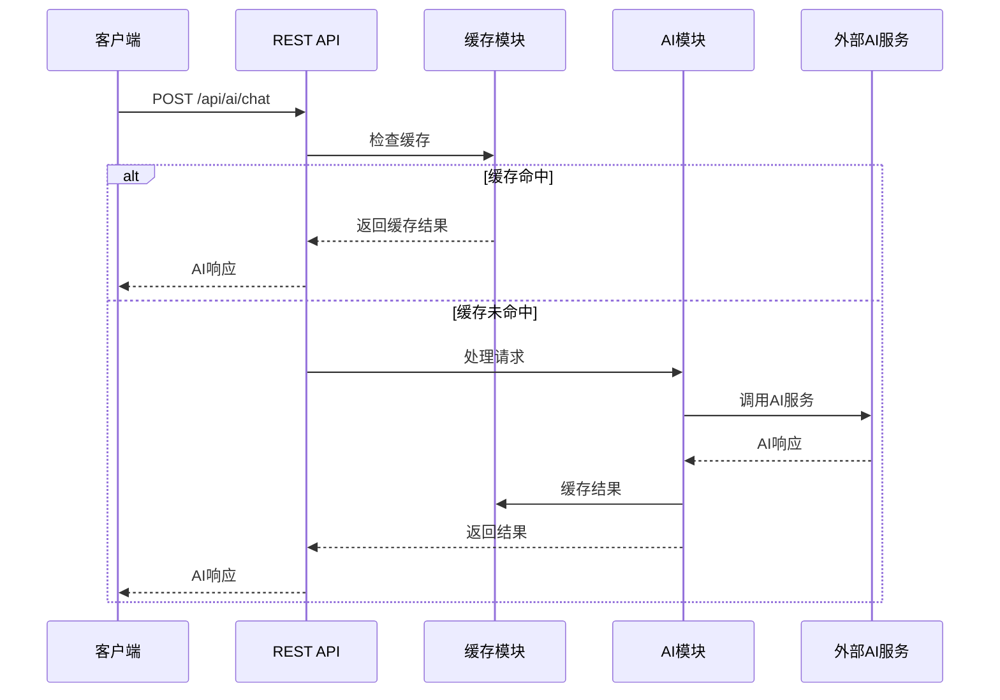

# 系统架构文档

## 概述

SSH AI Terminal是一个基于Rust的高性能SSH终端应用，集成了AI助手功能。本文档详细描述了系统的整体架构、组件设计和数据流。

## 架构概览

```
┌─────────────────────────────────────────────────────────────┐
│                    SSH AI Terminal                          │
├─────────────────────────────────────────────────────────────┤
│  ┌─────────────┐  ┌─────────────┐  ┌─────────────┐         │
│  │   Web UI    │  │   REST API  │  │ WebSocket   │         │
│  │             │  │             │  │             │         │
│  └─────────────┘  └─────────────┘  └─────────────┘         │
├─────────────────────────────────────────────────────────────┤
│                   应用层 (Application Layer)                │
├─────────────────────────────────────────────────────────────┤
│  ┌─────────────┐  ┌─────────────┐  ┌─────────────┐         │
│  │  认证模块   │  │  会话管理   │  │  连接池     │         │
│  │  (Auth)     │  │ (Session)   │  │ (Pool)      │         │
│  └─────────────┘  └─────────────┘  └─────────────┘         │
├─────────────────────────────────────────────────────────────┤
│                   业务层 (Business Layer)                   │
├─────────────────────────────────────────────────────────────┤
│  ┌─────────────┐  ┌─────────────┐  ┌─────────────┐         │
│  │  SSH模块    │  │  AI模块     │  │  缓存模块   │         │
│  │  (SSH)      │  │  (AI)       │  │  (Cache)    │         │
│  └─────────────┘  └─────────────┘  └─────────────┘         │
├─────────────────────────────────────────────────────────────┤
│                   服务层 (Service Layer)                    │
├─────────────────────────────────────────────────────────────┤
│  ┌─────────────┐  ┌─────────────┐  ┌─────────────┐         │
│  │  配置管理   │  │  日志系统   │  │  监控系统   │         │
│  │  (Config)   │  │  (Logging)  │  │ (Monitoring)│         │
│  └─────────────┘  └─────────────┘  └─────────────┘         │
├─────────────────────────────────────────────────────────────┤
│                   基础设施层 (Infrastructure Layer)         │
├─────────────────────────────────────────────────────────────┤
│  ┌─────────────┐  ┌─────────────┐  ┌─────────────┐         │
│  │  文件系统   │  │  网络栈     │  │  系统调用   │         │
│  │ (FileSystem)│  │ (Network)   │  │ (Syscalls)  │         │
│  └─────────────┘  └─────────────┘  └─────────────┘         │
└─────────────────────────────────────────────────────────────┘
```

## 核心组件

### 1. 应用层 (Application Layer)

#### Web UI
- **职责**: 提供用户界面
- **技术**: HTML5, CSS3, JavaScript
- **特性**: 
  - 响应式设计
  - 实时终端模拟
  - 多标签页支持
  - 主题切换

#### REST API
- **职责**: 提供HTTP API接口
- **技术**: Warp框架
- **端点**:
  - `/api/auth/*` - 认证相关
  - `/api/ssh/*` - SSH会话管理
  - `/api/ai/*` - AI交互
  - `/api/performance/*` - 性能监控

#### WebSocket
- **职责**: 实时双向通信
- **技术**: tokio-tungstenite
- **功能**:
  - 实时终端输出
  - 命令执行
  - 状态同步
  - 错误通知

### 2. 业务层 (Business Layer)

#### 认证模块 (Auth)
```rust
pub struct AuthManager {
    jwt_secret: String,
    sessions: DashMap<String, UserSession>,
    rate_limiter: RateLimiter,
}

impl AuthManager {
    pub async fn authenticate(&self, credentials: &Credentials) -> Result<JwtToken, AuthError>;
    pub async fn verify_token(&self, token: &str) -> Result<UserClaims, AuthError>;
    pub async fn refresh_token(&self, token: &str) -> Result<JwtToken, AuthError>;
}
```

#### 会话管理 (Session)
```rust
pub struct SessionManager {
    sessions: DashMap<String, SshSession>,
    config: SessionConfig,
}

impl SessionManager {
    pub async fn create_session(&self, request: &SessionRequest) -> Result<String, SessionError>;
    pub async fn get_session(&self, id: &str) -> Option<SshSession>;
    pub async fn close_session(&self, id: &str) -> Result<(), SessionError>;
}
```

#### 连接池 (Connection Pool)
```rust
pub struct ConnectionPool {
    pool: Pool<SshConnection>,
    metrics: PoolMetrics,
    config: PoolConfig,
}

impl ConnectionPool {
    pub async fn get_connection(&self) -> Result<PooledConnection, PoolError>;
    pub async fn return_connection(&self, conn: PooledConnection);
    pub fn get_metrics(&self) -> PoolMetrics;
}
```

### 3. 服务层 (Service Layer)

#### SSH模块
```rust
pub struct SshManager {
    connections: DashMap<String, SshConnection>,
    config: SshConfig,
}

impl SshManager {
    pub async fn connect(&self, host: &str, port: u16, credentials: &Credentials) -> Result<String, SshError>;
    pub async fn execute(&self, session_id: &str, command: &str) -> Result<String, SshError>;
    pub async fn disconnect(&self, session_id: &str) -> Result<(), SshError>;
}
```

#### AI模块
```rust
pub struct AiManager {
    client: AiClient,
    cache: LruCache<String, AiResponse>,
    config: AiConfig,
}

impl AiManager {
    pub async fn process_request(&self, request: &AiRequest) -> Result<AiResponse, AiError>;
    pub async fn get_suggestions(&self, context: &str) -> Result<Vec<String>, AiError>;
    pub fn get_cache_stats(&self) -> CacheStats;
}
```

#### 缓存模块
```rust
pub struct CacheManager {
    lru_cache: LruCache<String, CacheEntry>,
    config: CacheConfig,
}

impl CacheManager {
    pub async fn get(&self, key: &str) -> Option<CacheEntry>;
    pub async fn set(&self, key: String, value: CacheEntry);
    pub async fn invalidate(&self, pattern: &str);
}
```

### 4. 基础设施层 (Infrastructure Layer)

#### 配置管理
```rust
pub struct ConfigManager {
    config: AppConfig,
    watcher: ConfigWatcher,
}

impl ConfigManager {
    pub fn load_config(&mut self, path: &str) -> Result<(), ConfigError>;
    pub fn get_config(&self) -> &AppConfig;
    pub fn watch_changes(&mut self) -> Result<(), ConfigError>;
}
```

#### 日志系统
```rust
pub struct LogManager {
    logger: Logger,
    config: LogConfig,
}

impl LogManager {
    pub fn init(&mut self, config: &LogConfig) -> Result<(), LogError>;
    pub fn log(&self, level: Level, message: &str);
    pub fn log_with_context(&self, level: Level, message: &str, context: &LogContext);
}
```

#### 监控系统
```rust
pub struct MonitoringManager {
    metrics: MetricsRegistry,
    health_checker: HealthChecker,
    config: MonitoringConfig,
}

impl MonitoringManager {
    pub fn record_metric(&self, name: &str, value: f64);
    pub fn increment_counter(&self, name: &str);
    pub fn check_health(&self) -> HealthStatus;
}
```

## 数据流

### 1. SSH连接流程



### 2. 命令执行流程



### 3. AI交互流程



## 并发模型

### 异步运行时
- **Tokio**: 提供异步I/O和并发处理
- **工作线程池**: 处理CPU密集型任务
- **I/O线程池**: 处理网络I/O操作

### 并发控制
```rust
// 信号量控制并发数
let semaphore = Arc::new(Semaphore::new(100));

// 连接池大小限制
let pool_size = 50;

// 速率限制
let rate_limiter = RateLimiter::new(1000, Duration::from_secs(60));
```

### 数据共享
```rust
// 使用Arc和Mutex共享数据
pub struct SharedState {
    sessions: Arc<RwLock<HashMap<String, SshSession>>>,
    metrics: Arc<AtomicU64>,
}

// 使用DashMap进行高并发访问
pub struct ConcurrentSessions {
    sessions: DashMap<String, SshSession>,
}
```

## 安全架构

### 认证和授权
- **JWT Token**: 无状态认证
- **会话管理**: 用户会话跟踪
- **权限控制**: 基于角色的访问控制

### 网络安全
- **TLS/SSL**: 传输层加密
- **输入验证**: 防止注入攻击
- **速率限制**: 防止DDoS攻击

### 数据安全
- **敏感数据加密**: 密码和密钥加密存储
- **审计日志**: 操作记录和追踪
- **数据隔离**: 用户数据隔离

## 性能优化

### 内存管理
- **对象池**: 减少内存分配
- **LRU缓存**: 智能缓存管理
- **内存映射**: 大文件处理

### 并发优化
- **连接复用**: SSH连接池
- **异步处理**: 非阻塞I/O
- **负载均衡**: 请求分发

### 网络优化
- **压缩**: Gzip/Brotli压缩
- **缓存**: HTTP缓存头
- **CDN**: 静态资源分发

## 可扩展性

### 水平扩展
- **无状态设计**: 支持多实例部署
- **负载均衡**: 请求分发
- **数据分片**: 数据水平分割

### 垂直扩展
- **资源优化**: CPU和内存优化
- **连接池**: 连接复用
- **缓存策略**: 多级缓存

### 微服务架构
- **服务拆分**: 按功能模块拆分
- **API网关**: 统一入口
- **服务发现**: 动态服务注册

## 监控和可观测性

### 指标收集
- **应用指标**: 请求数、响应时间、错误率
- **系统指标**: CPU、内存、磁盘、网络
- **业务指标**: 用户数、会话数、AI请求数

### 日志管理
- **结构化日志**: JSON格式日志
- **日志级别**: DEBUG、INFO、WARN、ERROR
- **日志聚合**: 集中式日志收集

### 链路追踪
- **请求追踪**: 全链路追踪
- **性能分析**: 瓶颈识别
- **错误定位**: 快速定位问题

## 部署架构

### 单机部署
```
┌─────────────────┐
│   SSH AI Terminal│
│                 │
│  ┌─────────────┐ │
│  │   Web UI    │ │
│  └─────────────┘ │
│  ┌─────────────┐ │
│  │   API       │ │
│  └─────────────┘ │
│  ┌─────────────┐ │
│  │   SSH/AI    │ │
│  └─────────────┘ │
└─────────────────┘
```

### 集群部署
```
┌─────────────────┐  ┌─────────────────┐  ┌─────────────────┐
│   Load Balancer │  │   Load Balancer │  │   Load Balancer │
└─────────────────┘  └─────────────────┘  └─────────────────┘
         │                     │                     │
┌─────────────────┐  ┌─────────────────┐  ┌─────────────────┐
│   Instance 1    │  │   Instance 2    │  │   Instance 3    │
│                 │  │                 │  │                 │
│  ┌─────────────┐ │  │  ┌─────────────┐ │  │  ┌─────────────┐ │
│  │   Web UI    │ │  │  │   Web UI    │ │  │  │   Web UI    │ │
│  └─────────────┘ │  │  └─────────────┘ │  │  └─────────────┘ │
│  ┌─────────────┐ │  │  ┌─────────────┐ │  │  ┌─────────────┐ │
│  │   API       │ │  │  │   API       │ │  │  │   API       │ │
│  └─────────────┘ │  │  └─────────────┘ │  │  └─────────────┘ │
│  ┌─────────────┐ │  │  ┌─────────────┐ │  │  ┌─────────────┐ │
│  │   SSH/AI    │ │  │  │   SSH/AI    │ │  │  │   SSH/AI    │ │
│  └─────────────┘ │  │  └─────────────┘ │  │  └─────────────┘ │
└─────────────────┘  └─────────────────┘  └─────────────────┘
         │                     │                     │
         └─────────────────────┼─────────────────────┘
                               │
                    ┌─────────────────┐
                    │   Shared Cache  │
                    │   (Redis)       │
                    └─────────────────┘
```

## 技术栈

### 后端技术
- **语言**: Rust 1.70+
- **运行时**: Tokio
- **Web框架**: Warp
- **SSH库**: ssh2
- **序列化**: Serde
- **日志**: Tracing

### 前端技术
- **语言**: HTML5, CSS3, JavaScript
- **框架**: Vanilla JS (轻量级)
- **WebSocket**: 原生WebSocket API
- **UI组件**: 自定义组件

### 基础设施
- **容器**: Docker
- **编排**: Kubernetes
- **缓存**: Redis
- **监控**: Prometheus + Grafana
- **日志**: ELK Stack

## 未来规划

### 短期目标 (3-6个月)
- 完善监控系统
- 优化性能
- 增强安全性
- 改进用户体验

### 中期目标 (6-12个月)
- 支持更多AI提供商
- 实现插件系统
- 添加移动端支持
- 支持集群部署

### 长期目标 (1-2年)
- 企业级功能
- 云原生架构
- 国际化支持
- 生态系统建设